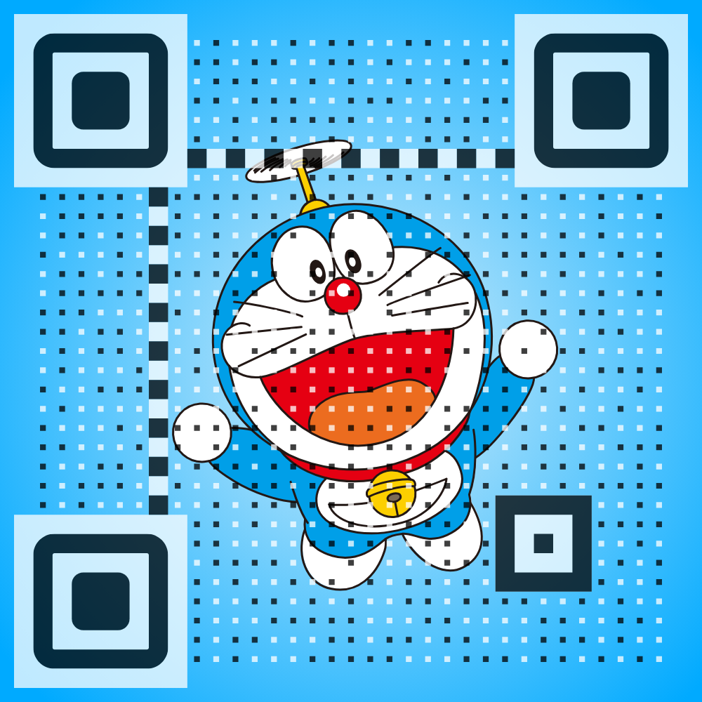

<!-- ── 顶部动态横幅 ── -->

  

<!-- ── 状态栏 ── -->

  
  
  
  
  
  

<!-- ── 角色标题与入场台词 ── -->
<h2 align="center">🌙 长夜青灯独行</h2>

  <b>你好，我是 <code>cyqddx</code>｜Python × AI 工程实践｜技术分享与文档炼金 🧪</b>

  🔭 专注领域：RAG 系统 · AI Agent 开发 · 文档工程化 · Python 后端

<!-- ── 社交链接 ── -->

  
  
  
  

 

---
<!-- 
## 🚀 代表项目 · Featured Projects

> 🏗️ 解锁条件：项目上线 · README 完善 · 可公开演示

<table width="92%" align="center">
  <tr>
    <td width="50%">
      <h4>🔮 Project Alpha — RAG 文档问答系统 <code>WIP</code></h4>
      
基于 LangChain + RAGAS 评估的多源技术文档检索问答 · 生产级部署实践

      

        
        
        
        
      

      🚧 开发中 · ETA 2026 Q3
    </td>
    <td width="50%">
      <h4>⚡ Project Beta — AI Agent 工作流引擎 <code>WIP</code></h4>
      
LangGraph 驱动的多智能体协作系统 · MCP 工具链集成

      

        
        
        
        
      

      🚧 探索中 · 方案设计阶段
    </td>
  </tr>
</table>

--- -->

## ✒️ 格言录 · Creed

<table align="center" width="92%">
  <tr>
    <td align="center">
       
      <b>「 可复现的结果，才值得相信。 」</b> 
      工程理性 · 反复打磨 · 可验证
        
      <b>「 理解，才是真正的拥有。 」</b> 
      会用 → 懂原理 → 能复现 → 可迁移
        
      ⚔️ <em>代码是咒语，终端是法阵，Bug 是异界生物。</em>
        
    </td>
  </tr>
</table>

---

## 🪪 世界观面板 · Profile HUD

<table width="92%" align="center">
  <tr>
    <td width="25%"><b>🏷️ 称号</b></td>
    <td>AI 工程师 · 文档炼金术士 · 自动化召唤师</td>
  </tr>
  <tr>
    <td><b>⚔️ 阵营</b></td>
    <td>工程理性 · 可复现主义 · 反复打磨派</td>
  </tr>
  <tr>
    <td><b>🔮 主属性</b></td>
    <td>Python · AI / LLM · 工程化 · 自动化</td>
  </tr>
  <tr>
    <td><b>📖 主线任务</b></td>
    <td>Chapter ∞：从 API Caller 进化为 AI Engineer</td>
  </tr>
  <tr>
    <td><b>🎯 年度冲刺</b></td>
    <td>Agent 工程化落地 · 首个 LoRA 微调实验 · 技术博客月更不断</td>
  </tr>
<tr>
  <td><b>🔑 战斗装备</b></td>
  <td>
    
    
    
  </td>
</tr>
<tr>
  <td><b>🛠️ 实体装备</b></td>
  <td>
    
    
    
    
  </td>
</tr>
</table>

---

## 🌳 技能树 · Skill Tree

> 图例：`✅` 已装备（主力输出）｜`🧪` 研发中（正在点技能）｜`🔒` 待解锁（未来技能位）

<b>✅ 已装备 — 主力输出层</b>

 

🤖 AI / LLM 

  
  
  
  
  

→ 生产级 RAG 系统搭建 · RAGAS 评估流水线 · MCP 工具链集成 · Prompt 迭代优化
  

⚙️ 工程基础 

  
  
  
  
  
  
  

→ FastAPI 构建 REST 服务 · Docker 容器化部署 · PostgreSQL / Redis 持久化与缓存
 

<b>🧪 研发中 — 技能解锁进行时</b>

 

🤖 AI 进阶 

  
  
  

→ 探索 Agent 编排与 LangGraph 状态机 · 参数高效微调实践中
  

💻 语言扩展 

  
  
  

→ 补强系统编程基础 · 为高性能服务场景储备
 

<b>🔒 待解锁 — 未来技能位（点击展开）</b>

 

🤖 AI 深层 

  
  
  
  

→ 从调用模型到理解模型 · 模型推理加速与大规模向量检索
 

---

## 📡 战斗记录 · GitHub Stats

  
  

<!-- 贡献热力图 -->

  

---

<!-- =========================================================
  ☕ 请我喝杯咖啡（注释状态，需要时解开）
========================================================= -->

<!-- ## ☕ 充能（请我喝杯咖啡）

     
  

  感谢支持，会用来续命写文档 & 造轮子 🛠️✨

--- -->

<!-- ── 底部座右铭 + 收尾波浪 ── -->

  「 凌晨三点的终端，见过的光，比星星更多。」

  

