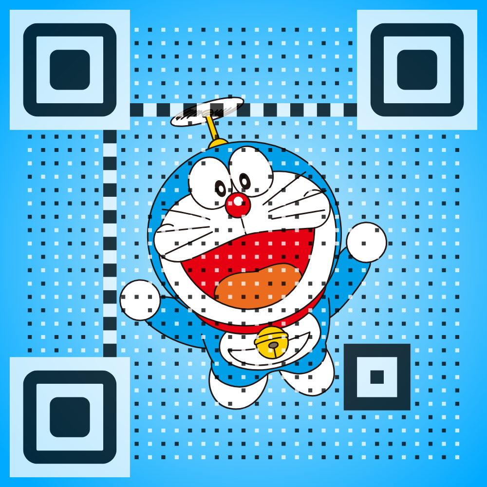

<!-- =========================================================
  Profile README for: cyqddx
  风格：二次元 / RPG UI / 夜色霓虹（克制版）
  稳定策略：
  - 访客计数类服务易失效：默认使用静态徽章
  - GitHub 状态图：使用仓库内生成 summary cards（推荐）
========================================================= -->

<!-- 右上角徽章：稳定（不依赖计数服务） -->

<!-- 如果你之后找到了可用的访客计数服务，替换下面这行并取消注释即可 -->
<!--

-->

<h1 align="center">🌙 长夜青灯独行</h1>

  「代码是咒语，终端是法阵，Bug 是异界生物。」 
  <b>你好，我是 <code>cyqddx</code>｜编程与技术分享｜工程化实践记录 🧪</b>

  
  
  

---

## 🪪 世界观面板（Profile HUD）

<table>
  <tr>
    <td><b>称号</b></td>
    <td>夜行工程师 / 文档炼金术士 / 自动化召唤师</td>
  </tr>
  <tr>
    <td><b>阵营</b></td>
    <td>开源友好 · 工程理性 · 可复现主义</td>
  </tr>
  <tr>
    <td><b>主属性</b></td>
    <td>Linux + 后端 + 工具链 + 自动化</td>
  </tr>
  <tr>
    <td><b>被动技能</b></td>
    <td>复盘、写文档、拆模块、反复打磨</td>
  </tr>
  <tr>
    <td><b>当前章节</b></td>
    <td>Chapter ∞：把“会用”升级成“懂原理 + 能复现 + 可迁移”</td>
  </tr>
</table>

---

## 🧭 任务面板（Quests）

- ✅ **主线任务**：持续整理技术笔记（Docs 更新中）
- 🧩 **支线任务**：脚本化/服务化小工具（减少重复劳动）
- 🧠 **隐藏任务**：建立个人工程体系（规范、模板、自动化流水线）

---

## 🧰 装备栏（Tech Stack）

<table>
  <tr>
    <td><b>语言</b></td>
    <td>
      
      
      
      
      
    </td>
  </tr>
  <tr>
    <td><b>平台 / 工具</b></td>
    <td>
      
      
      
      
      
    </td>
  </tr>
</table>

---

## 📡 战斗记录（GitHub Summary Cards · 稳定版）

> 这些图来自仓库内 `profile-summary-card-output/`（由 GitHub Actions 生成并提交）。
> 不依赖外部统计站点，稳定性更高。

  

  
  

  
  

<!-- 可选：传统外链 stats（偶尔会抽风），想用再放开 -->
<!--

  
  

-->

---

## 🧩 常驻据点（Links）

- 🌐 Blog：<https://blog.20010117.xyz>
- 📘 Docs：<https://docs.20010117.xyz>
- 📺 Bilibili：<https://space.bilibili.com/480620671>

---

<!-- =========================================================
  ☕ 请我喝杯咖啡（按你的要求：默认注释掉）
  想启用时，把这一段的注释去掉即可
========================================================= -->
<!--
## ☕ 充能（请我喝杯咖啡）

  

  感谢支持，会用来续命写文档 & 造轮子 🛠️✨

-->

  「愿你每次 <code>git push</code> 都是一次升级。」

